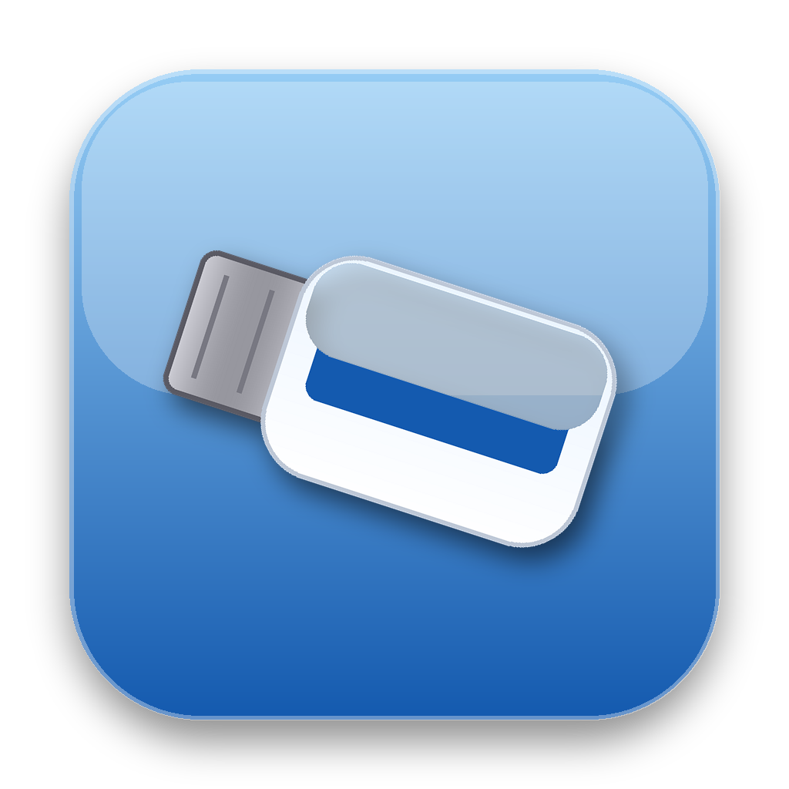

# exFAT for Tiger (PowerPC)

A small menu bar app + command line tools that let Mac OS X 10.4 Tiger (yes, PowerPC, yes, 2005) read and write exFAT drives.

Mac OS X 10.4 Tiger（PowerPC）で exFAT ドライブの読み書きができるようになる、GUI操作だけで完結するメニューバーアプリです。

## Why this exists

I still use a Power Mac G4 running Tiger for daily light work, because it's just... snappy. Faster to feel usable than a lot of modern machines doing the same simple tasks. But exFAT support only came to Mac OS X in 10.6.5, and current MacFUSE / macFUSE dropped PowerPC after Leopard, so a G4 owner in 2026 has basically no way to read a modern exFAT flash drive.

Turns out the pieces to fix this already existed (old MacFUSE 1.7.0 built for 10.4, and the open-source `fuse-exfat` project), they just never got put together and tested on real Tiger PPC hardware before, as far as I could find. So I built it, with a lot of help from Claude (Anthropic's AI) doing the actual remote debugging over SSH on my G4 — I don't write Objective-C, and honestly this old toolchain has enough weird corners that even the AI needed several tries. Full transparency: yes, an AI helped write this and part of this README. I only know a little English, so please don't expect perfect wording here — Japanese and English don't even build sentences in the same order, and I'd rather ship something useful than spend a week polishing my grammar. If that bothers you, the source and the technical notes below should be enough to judge the actual work on its own.

## What's in here

- **exFAT Menu.app** — menu bar utility. Click the "exFAT" item, pick a drive to mount or a mounted one to eject.
- **bin/** — the underlying command line tools (`mount.exfat`, `fsck.exfat`, `mkfs.exfat`, `exfatlabel`, `dumpexfat`, `exfatattrib`), built from [relan/exfat](https://github.com/relan/exfat) with two small patches for this old MacFUSE (see `patches/`).
- **src/** — the app's Objective-C source (no nib file, no Xcode project needed — it's small enough to just compile directly).

## Requirements

- Mac OS X 10.4 Tiger, PowerPC (should also work on Intel Tiger, untested)
- [MacFUSE Core 10.4-1.7.0](https://web.archive.org/web/20120127043005/http://macfuse.googlecode.com/files/MacFUSE-Core-10.4-1.7.0.dmg) installed first (this is the old Google-era MacFUSE, from the Wayback Machine — the "official" download you'll find today is a newer stub installer that just phones home to a server Google shut down years ago, and won't work)

## Install

1. Install MacFUSE Core 10.4-1.7.0 (link above), reboot if it asks.
2. Run `install.sh` from this folder (it just copies the CLI tools into `/usr/local/sbin` — read it first if you don't trust random shell scripts, it's short).
3. Drag `exFAT Menu.app` to `/Applications` or wherever, double-click it. It lives in the menu bar only, no Dock icon.

## Using it

Plug in an exFAT drive. Tiger will complain it can't read it — ignore that dialog, it's Tiger's own broken built-in NTFS driver trying (and failing) to guess the filesystem, not this app.

Click "exFAT" in the menu bar → "Mount: disk_s_ (...)". A folder alias named `exFAT (disk_s_)` appears on your Desktop — that's your drive. To remove the drive, use the app's "Eject" entry first, *then* unplug (same as any other drive).

## Technical notes, for anyone doing similar archaeology

A few things that weren't documented anywhere I could find, in case they save someone else a night of debugging:

- **`-o big_writes` breaks this old libfuse.** `fuse-exfat` enables it by default on any non-Linux \*BSD-flavored build, but MacFUSE 1.7.0 (2008) doesn't understand the option and mount just fails with `fuse: unknown option 'big_writes'`. Patched out.
- **`diskutil info` on every attached disk can hang the whole machine.** If any external drive is spun down, each call blocks waiting for it to wake up. Don't loop `diskutil info` over partitions — parse `diskutil list` (one call) instead.
- **exFAT drives show up as `Windows_NTFS`** at the partition-map level, so Tiger auto-mounts them with its own read-only NTFS driver on insertion. That mount is empty and useless (real NTFS ≠ exFAT internally) — the app runs `diskutil unmount` on the raw device before mounting for real, to get rid of it.
- **Finder's own "MacFUSE Volume N" desktop icon for FUSE mounts is unreliable** — sometimes it shows up, sometimes it doesn't, and either way it can survive a clean unmount as a dead, empty-looking icon that needs a full logout to clear. Passing `-o nobrowse` to the mount stops MacFUSE from registering with DiskArbitration/Finder at all — but that option is silently dropped unless you also patch fuse-exfat's option passthrough allowlist (see `patches/`). The app makes its own plain Desktop symlink instead, which turned out to be 100% reliable where Finder's native integration wasn't.
- Building this needs `autoconf`/`automake` that Tiger doesn't have — generate `./configure` on a modern Mac and copy the pre-generated tree over, or install Tigerbrew.

## Credits

- [relan/exfat](https://github.com/relan/exfat) — the actual exFAT filesystem implementation, GPLv2
- Google's original MacFUSE 1.7.0 for 10.4
- [daniel-toman/homebrew-exfat](https://github.com/daniel-toman/homebrew-exfat) — the README that pointed at the right pieces and got this whole idea started

## License

The CLI tools bundled here are `fuse-exfat`, GPLv2 (see `LICENSE-GPLv2.txt`). The app source and icon in this repo (`src/`, `icon/`, `install.sh`) are MIT (see `LICENSE`).

---

※マウント・取り出しのメニューは、普段のAppleメニュー（画面左側）ではなく、画面右側のバッテリーなどが表示されているメニューバーエリアに出ます。ここは絶対に迷うところなので注意してください。
